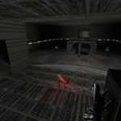
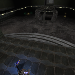
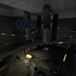

Okay, since the UT3 Titan pack expansion came out a couple weeks ago, interest has risen in UT3 once more, and so has my desire to carry on mapping in it. Hopefully, sometime soon, my interest will peak, and CTF-Orbital will see a flurry of activity and maybe even a release.  
Below are a few shots of how the map look currently. As it stands the layout is done, but the lighting is very basic 'working' lights.

As it stands the map is bot playable, so I'm looking for feedback. Some feedback has already been made [here](http://forums.beyondunreal.com/showthread.php?t=182976) and you can find the downloads there as well.  
(This is most definitely still Alpha quality work, so don't expect too much)
