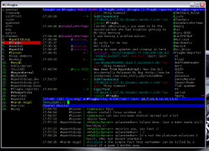

So I've been meaning to do it for some time, find an CLI IRC client for my linux box, so I can OS hop on the main box.

The main drawback of the 'usual suspects' were I never found them all that intuitive, or configurable. I finally stumbled across [Weechat](http://weechat.flashtux.org/), the dev version (now 0.3.0-RC2) is both easy-to-pickup and customise. The only thing it was missing for me was something like HydraIRC's "Channel Monitor", but with the wide array of scripting languages, I figured why not? and wrote it from scratch, with a little guidance and ideas from #weechat.

So now, my IRC looks like this:  
([Before](/wp-content/uploads/2009/07/irc-before.png))

