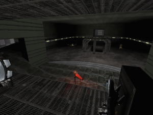
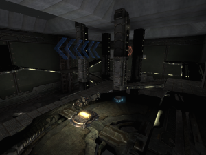
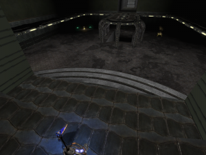

This is still very much an alpha work in progress, and as of this moment (Sept '09) partially stalled. I say partially, as the main thing needed for this is more feedback on level layout and weapon placement. I _think_ the current layout makes for good playability, but I'm slightly biased, and have been staring at it for too long to really tell.

If you want to help out, head over to [http://forums.beyondunreal.com/showthread.php?t=182976](http://forums.beyondunreal.com/showthread.php?t=182976) and drop some feedback.

