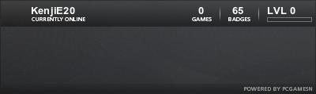

## About Me

Longbow (aka KenjiE20)

**Role:** Administrator

**Data:** Creator and administrator of Longbows Lair. Has a great want to being highly random.

Enjoys spending vast majorities of his time gaming on almost every genre of game, baring sports. Can usually be found immersing himself in RPG realms, building strange constructions, or otherwise fragging a lot of things at high speed.

Despite being the administrator of LB's Lair, he normally manages to distract himself sufficiently that work on the site rarely ever gets done.

Freelance Computer Technician and Web Designer / Consultant.

List of works;

- [Elliott Military Web Store](http://www.elliottmilitary.co.uk)
- <del datetime="2009-07-27T15:36:05+00:00">Merc-Inc Gaming Guild Site</del> now offline
- <del datetime="2009-07-27T15:36:05+00:00">Illusion Gaming Guild Site</del> now offline

Various Interests;

[](http://sig.anidb.net/redirect/7359/ue600/)

[](http://steamsignature.com)

[](http://raptr.com/KenjiE20?src=em_all)

[](http://profile.xfire.com/kenjie20)


## The Site

The site was started with the premise of simple gaining a foothold on the web.  
It has grown and changed vastly since it's first inception;

#### Site history

There are a couple of ways to count the versions of the site but this is the one I prefer;

- The website was started back in 1998, out of a random desire to get a personal foothold on the internet, as a tiny randomly changing content website, based on free hosts, whilst in High School.  
That was when it was basically just a cheat page (one of the thousands). It then evolved to the first 'real' version where it gained something thus far never thought of before..... content.
- Version 1, was HTML based, and gained a few games, a forum and some random titbits for various games, still based out of free hosts. Towards the end of version 1 it also became base of operations for the radio station we tried our hand at.  
It was dubbed version 2 of the site but can't really be counted as the second version.
- Then version 2 happened, with its new spangly PHPNuke based system, which served as a better base for radio presenters to pass news on, or at least that was the idea. Then time on the part of presenters became and issue and I couldn't justify keeping the station running, but the site remained  
This version of the site didn't last very long but still get's it's own version as it was a part of the development of LB's Lair as it is now.
- And then the hack on the PHPNuke system happened, and we ended up with version 3, powered by PostNuke (the much securer fork of PHPNuke).  
About this point I also progressed(?) onto University and teamed up with a new set of content providers.  
Since 3.0 we had a site theme redesign, and the addition of a new gallery system and a few other tweak. I belive it to be something like 3.2 since we upgraded to the latest security release and added various bits.  
And now we are faced with the concept of creating regular amount of content for the site.
- The site then moved onto Joomla! which made handling and maintaining the site much easier.  
It was dubbed version 4.0 of the site
- At the end of May / beginning of June I suffered a major hack attempt on the site. I lost everything; email, databases, files, archives, all gone, unfortunately I missed my backups and my hosts made a backup just after it occurred, and before I noticed.
- This has had a two fold effect, I lost the original version 4.0 of the site, but can now recreate 4.1 totally from scratch.  
So a new theme and a slightly different feel of content is probably in order.
- In 2009 the site marks 10 years online and yet again changed systems, this time to WordPress (and becoming v5 into the bargain), due mainly to the need to re-edit data for Joomla 1.5 and wanting a more lightweight system.
- Mid-2009 saw another attack, this time aimed at the hoster's VPS systems. This had the effect of knocking a lot of sites off the net, and not only on our VPS, fortunately this time, there was minimal loss of data. WP got an update, and OpenID commenting got added.

\-\- Longbow (aka KenjiE20)

You can link to us using the following code;

```
<a href="http://www.longbowslair.co.uk" target="_blank">
</a>
```

To produce;
[](http://www.longbowslair.co.uk)
