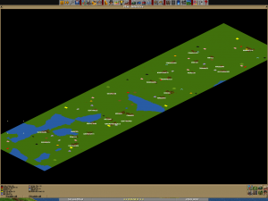
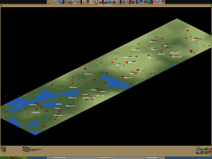
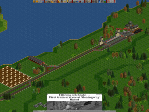
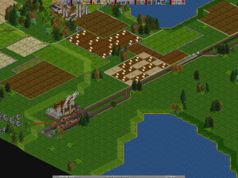
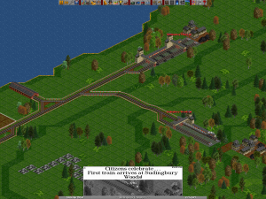
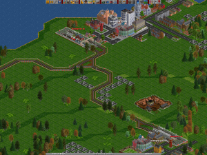
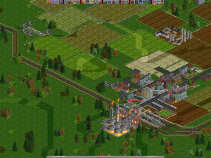

So I decided to start up a new OpenTTD game, on a 128×512 map. Using the OpenTTD nightly, starting with r15260.  Main modifiers are;

- UK Renewal Set
- Reduced Breakdowns
- x4 weight multiplier for freight
- A full GRF list can be viewed behind the Read More link

The Industry Map; 
The height map; 

In 1950 a small start-up makes it’s humble beginnings on the far southern edge of the region. A temporary maintenance depot is set up and a 2-8-0 Freight Engine raked up for the short jump to the local power station.

Which is quickly joined by a second identical consist for the second coal mine on the hill.

Shortly after, the two worker towns near the mines express an interest in a passenger line. A 4-6-0 ‘Standard-Five’ is commissioned for the link, and Sleningway Transport is born, running out of the station offices for now.

With the foundations laid, Sleningway Transport turns it’s attention to an abitious project of linking up the southern towns to create the South Mainline, and first on the list for connection is Fentfingford. A 4-6-2 ‘Pacific’ can be see pulling into the terminus on the inaugural run.

<!--more-->

The full NewGRF list:

- riversw.grf
- pb\_ukrs.grf = 0 3 0
- ukrsap1w.grf
- ttrs3w.GRF = 1 0 0 1
- stolentreesw\_162.grf
- UKRoadsetw.grf
- BKTunw.grf
- total\_bridges\_alpha2.grf
- brickfreightw.GRF
- ae\_cityw.GRF
- egrvts.1.0\\egrvts.grf
- harbourw.grf
- buffers.grf
- pb\_hovs\_bus.grf
- indstatrw.grf
- swyardw.grf
- modernsuburbanw.GRF
- newshipsw.grf
- newstatsw.grf
- platformsw.GRF
- ae\_ruraw.GRF
- ae\_subuw.GRF
- ukwaypointsw.grf
- foundw.grf
- pb\_av8w.grf
- moderntramset.grf
- ukts\_r1.grf
- TranspEngShowRunw.GRF
- bigdepot.grf
