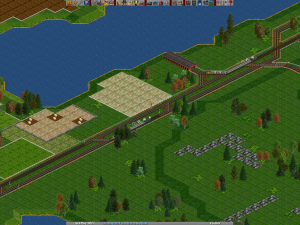
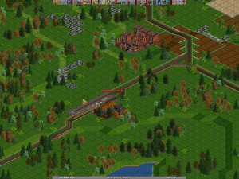
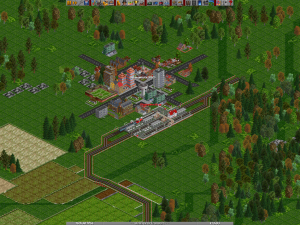
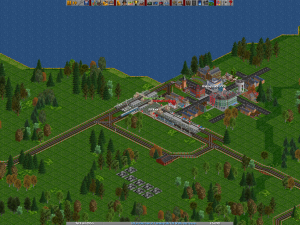
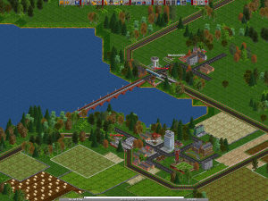

After and increase in Coal production, and extra 2-8-0 is bought to help cope with the extra cargo, and the line is double tracked.

Demand for furnishings has been on the rise, and the local sawmill requested a new branch line be put in. Two more 2-8-0’s are bought, one for the new timber line, and a second to supplement the second coal mine due to an increase in production.

Meanwhile work continues on the main line and Duningworth is connected up, with a 4-6-2 ‘Pacific’ hauled service to Fentfingford. A new service centre is also opened at Fentfingford.

Hadington marks completion of the first half of the South Mainline project, and is set to become the next hub station on the network.

The new 4-6-2 ‘Pacific’ links it to Duningworth, while the experimental diesel ‘AEC Railcar’ in a 4 car consist, makes the slow link to Sleningway, via the small towns of Binnford and Prenville.

Next on the planning agenda is a platform extention at Fentfingford, and an express service linking Sleningway and Hadington, via Fentfingford and Duningworth. Both Slen <-> Had links are expected to be subject to a timetable service.
