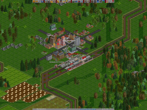
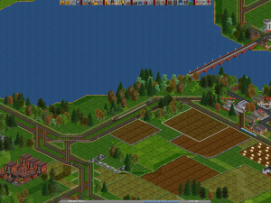
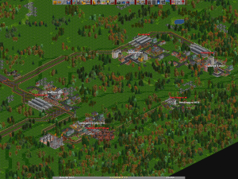
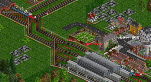
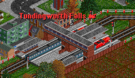

After many hours of planning, the new Junction at Duningworth is constructed, plans for an extra platform at Fentfingford were rejected and the buffers were removed instead. The entire line is now double tracked, and a new 4-6-2 ‘Streamliner’ brought in for the new run. Seen here loading up at Duningworth, while the local pulls in alongside.  A new plantation appears new the branch line at Binnford, so a new 2-8-0 is commissioned for the run, seen here giving priority to the diesel passenger train at the modified Prenville Junction.  After many, many days of long planning meetings between Management, Construction and 4 different Town Planners, the plans for the second half of the Mainline were finalised. Initially a loop-line was planned to service Hadtown, Harnhall, Cunwood, Tudingworth Falls and Buntfingway, but all the proposals were too complex and expensive. So Tudingworth Falls and Buntfingway became a branchline from Hadtown.

Shortly after construction had completed on the Tudingworth Falls station, the neighbouring Steel Mill announced it would be [shutting it’s doors](/wp-content/uploads/2009/02/sleningway-transport-13th-apr-1955-steel.png).

Keen to keep it’s residents and it’s new station, Tudingworth Falls announced two special subsidised non-stop links between itself and Cunwood and Handingtown. Two 4-6-0 ‘Standard Five’s were raked up for these services and are show here leaving the local service depot, heading to Tudingworth Falls for the stations opening. 

Less than a month after services begin, Tudingworth Falls oil refinery also shuts down.  Tudingworth Falls local authority don’t seem to be too concerned though. They gave the go ahead for the track to be doubled, and thanks to the subsidised links the town continues to grow.

Meanwhile a 0-6-0 ‘Pannier Tank’ is brought on for the local service from Hadtown to Buntfingway via Tudingworth Falls, and two 4-6-2 ‘Pacific’ is set on the Hadingtown, Cunwood stopping service. New development in freight engines has resulted in the 2-10-0 and one is put into service on the Binnford timber train.
