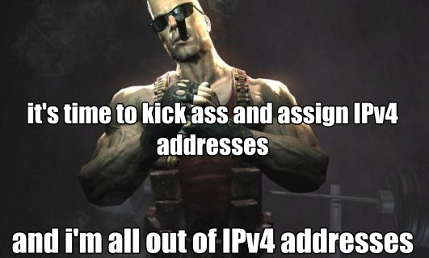

Yup, it happened, we ran out of IPv4 addresses to give out. [http://inetcore.com/project/ipv4ec/index\_en.html](http://inetcore.com/project/ipv4ec/index_en.html)

You can check your IPv6-ness here [http://test-ipv6.com/](http://test-ipv6.com/)
