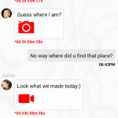
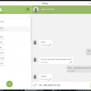
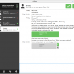
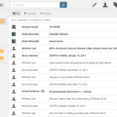

The holy grail for mass adoption of encrypted chat and email, but I'm not going to lecture about why this is important. Instead, I want to list some of the tools that are cropping up, list some pros and cons, and hopefully keep it up to date, and help a few people keep their personal lives, personal.

EFF recently put up their [Secure Messaging Scorecard](https://www.eff.org/secure-messaging-scorecard), detailing various privacy elements of messengers.

\[Update; 2014-09-17 - Appear.in\] \[Update; 2014-09-18 - Bleep - Open Alpha\] \[Update; 2014-10-07 - Bleep patch, Telegram, FireChat\] \[Update; 2014-11-07 - EFF, surespot\]

<!--more-->

So in no particular order, here's a summary of interesting things I've come across so far;

### Chat/Messaging

- [Wickr](https://www.wickr.com/) - End-to-end encrypted, self destructing messaging, for Android and iOS. Think a secure version of Snapchat.
    - Pros;
        - Contains file-shredder and has group chat features.
        - Can handle multiple devices per account
        - Stable, released 2012
    - Cons;
        - Relies on Wickr servers
        - No desktop client
        - Proprietary

- [Hemlis](https://heml.is/) - Secure messaging with a sleek UI. Heavily inspired by the look, feel and usability of iMessage, but built and expanded on open-source libraries, and started by founders of TPB and flattr. Hemlis looks promising.
    - Pros;
        - Multi-platform (Android, iOS first, Others probably to follow later)
        - Heavy focus on usability
    - Cons;
        - Currently unreleased (closed beta)
        - Relies on Hemlis servers (Messages only remain until delivered, discarded in time if failed delivery)
        - Proprietary (open source is probable post-release)
        - May use micro-transaction for sub features
- [Bleep](http://labs.bittorrent.com/bleep/) - Decentralised messaging from BitTorrent. Bleep, uses no central server, instead uses a set of 'nodes' to connect to the swarm of clients, who can inform each other, of how to reach one another. Once the client has info on other contacts, messages are sent directly.
    - Pros;
        - Also allows Voice chat
        - Planned multi-platform (Win 7/8, Android, others to follow)
        - Decentralised
    - Cons;
        - Open Alpha (WiFi-only recommended on android (2014-10-07; Patch issued to help with data usage), known heavy battery drain)
        - Closed Source
        - Can transfer account between devices, but sent messages don't sync
- [Tox](http://tox.im) - Tox is less chat program, and more of a protocol, though they do provide their own client. Tox is a decentralised, open-source, secure Skype replacement.
    - Pros;
        - Voice, video chat, Skype replacement
        - Ease-of-use and easy set up is a heavy focus
        - Decentralised
        - Multi-platform (Windows, Linux, Android, iOS clients)
        - Open-source
    - Cons;
        - Very early alpha (but with active development community)
        - Single device account (plans are being drawn up for ways to allow multiple)
- [Telegram](https://telegram.org/) - Telegram is similar to Wickr, a cloud based chat system, with emphasis on privacy. It has an open protocol and API.
    - Pros;
        - Multi-platform (runs on Android, iOS, Windows Phone, Windows, Mac and online)
        - Good looking UI
        - Distributed servers
        - Handles multiple devices
        - Free, without ads
        - Options for timed, and end-to-end encryption
    - Cons;
        - Relies on servers
        - Uses phone number as account username
        - Cannot sync 'secret messages' between devices
- [FireChat](https://opengarden.com/firechat) - FireChat rose into the spotlight during the Hong Kong protests as a direct local peer to peer communication tool. Built by OpenGarden upon their OpenGarden: Internet Sharing systems.
    - Pros;
        - Multi-platform (runs on Android, iOS)
        - Nearby mode for local off-the-grid communication
        - Free
    - Cons;
        - While anonymous, has come under some criticism for not having any details about encryption, or protocol information.
- [surespot](https://www.surespot.me/) - surespot is an open source mobile messenger, featuring end-to-end encryption, and self destructing messages.
    - Pros;
        - Multi-platform (runs on Android, iOS)
        - Free
        - Open-source
        - Can handle multiple user profiles
        - Can handle multiple devices (export and import profile)
    - Cons;
        - No desktop client (plans to expand soon)
        - Not yet code audited

### Other

- [Appear.in](https://appear.in/) - Slightly different approach to a Skype replacement, Appear.in is an HTML5 cloud solution (and recently released an iOS app) for group video/voice chat. Appear.in runs peer-to-peer, and encrypted, firewalls permitting.
- [Mail-pile](https://www.mailpile.is/) - Mailpile is an interesting take on e-mail. It installs like other email clients, but provides a G-mail like web UI. It pulls via IMAP from any email account you give it, and has encryption tools built right in, as well as local search indexing. Open-source and currently in beta, available for Windows and Mac (Linux packages to come)
